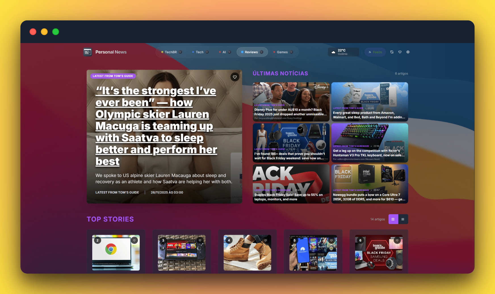

# Personal News



Personal News is a feed reader designed to work as a fast personal homepage for the web and as a packaged desktop app. It combines curated defaults, category-specific layouts, resilient feed parsing, and cache-first navigation so previously loaded content stays visible while the app refreshes in the background.

Also available in [Portuguese](README.pt-BR.md) and [Spanish](README.es.md).

## What the application does

- Aggregates RSS, Atom, RDF, and YouTube feeds in a single interface.
- Ships with curated categories such as Design, Games, Technology, Politics, and Videos.
- Allows each category to use a different presentation mode, including bento, list, immersive, and brutalist layouts.
- Uses cache-first feed loading with background revalidation to avoid blank states during navigation.
- Supports feed discovery, category management, import/export, favorites, and desktop packaging.

## Current highlights

### Cache-first navigation

The feed now favors locally cached content first and refreshes network data in the background. This keeps category switches responsive and reduces the perceived loading cost of large feed sets.

### Mixed content model

The default catalog combines traditional news feeds with YouTube channels. Video-heavy categories can use a dedicated visual system without affecting the layout of the rest of the app.

### Reading and sanitization pipeline

The app normalizes external feed data, extracts useful article metadata, and sanitizes rendered content before it reaches the UI. The goal is to keep third-party content readable without trusting source markup blindly.

## Tech stack

- React 19
- TypeScript 5
- Vite 8
- Bun for package management and most local scripts
- Vitest and Playwright for testing
- Tauri for desktop packaging
- Quality Core tooling for repo-level validation and reports

## Quick start

### Requirements

- Bun 1.2+
- Node.js 20+ for ecosystem compatibility

### Run locally

```bash
git clone https://github.com/mafhper/personalnews.git
cd personalnews
bun install
bun run dev
```

### Useful validation commands

```bash
bun run type-check
bun run test:core
bun run build
```

### Local stack with helper services

```bash
bun run dev:local
```

Use this when you want the app and its local support stack to start together.

## Project structure

- `components/`: UI building blocks and layout systems.
- `hooks/`: application state hooks, including progressive feed loading.
- `services/`: parsing, caching, import/export, and content processing logic.
- `constants/`: curated categories and starter feeds.
- `apps/desktop/`: desktop shell and release packaging.
- `docs/`: technical reference for contributors and evaluators.

## Documentation

- [Technical overview](docs/technical-overview.md)
- [Package scripts guide](docs/package-scripts-guia.md)
- [Contributing](CONTRIBUTING.md)

## Contributing

Issues and pull requests are welcome. If you plan to contribute code, start with [CONTRIBUTING.md](CONTRIBUTING.md) and run the project validation commands before opening a PR.

## License

This project is available under the [MIT License](LICENSE).
